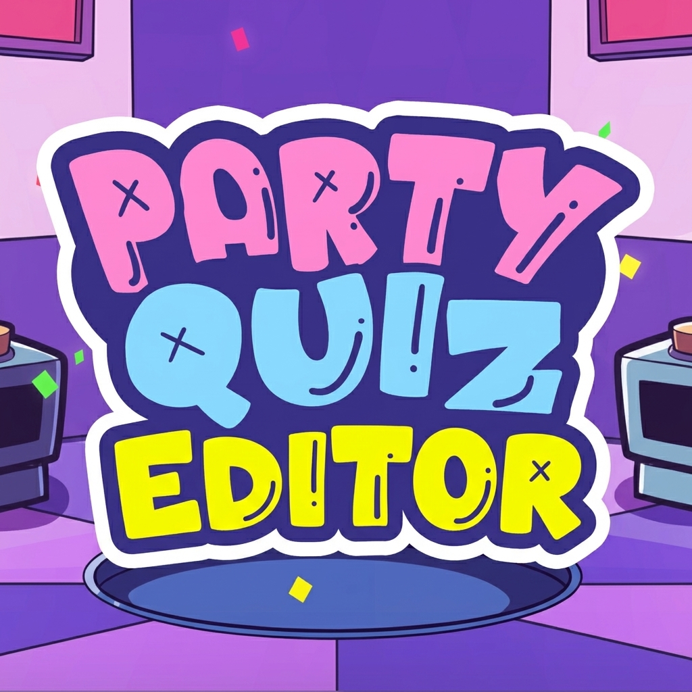

# PQEditor — Standalone Party Quiz Pack Editor

**EN** | [RU](#ru)

Standalone desktop editor for **Party Quiz** `.pq` packs (Jeopardy-style). No Unity/IL2CPP reverse-engineering — format inferred only from exported `examples/*.pq` + human description. Produces 100% compatible packs.



---

### Features

* **ZIP + `manifest.json` `Version 22`** — `Pack/Icon/Rounds/Themes/Questions`, enums (`Difficulty/Category/Language/AgeRating/RoundType/QuestionType`), `Picture/Audio/Video + EditParams`, `RevealingClues`, `IsFinal`
* **All question types:** Normal / Cat in Bag (`Кот в мешке` → `Cat` in EN) / Auction / Quiz (4 options) / Leading Hints (5 hints, drag-reorder) / Guess the Number / Final Question (`IsFinal`)
* **Per-media settings (non-destructive):** Photo — crop `CropL/T/R/B 0..1` + `Zoom/FlipX/Y` (draggable rectangle); Video/Audio — trim `TrimStart/End`, `Volume 0..1`, `Speed 0.1..2.0` with waveform/timeline + red playhead + `Play/Pause/Stop`
* **Media:** 3 independent buttons `Photo/Video/Audio` — rule `photo↔audio` compatible, `video` exclusive; `Choose` locks when occupied, `Clear/Settings` only when occupied; drag & drop; duplicated on `question/answer` + `cover` root
* **UI:** `PySide6` — multi-pack tabs, dirty `*`, `Sort by price`, `Assign randomly` (Auction/Cat), round/theme grid, `Undo/Redo`, validation, `QDockWidget` fixed (not detachable), app icon `icon.ico`
* **i18n:** UI `English` default / `Русский` (`Language` menu, `config.json:ui_language`), pack `Language` separate in `Export`
* **Build:** `PyInstaller` `onedir` (`dist/PQEditor/_internal` `~700MB`) and `onefile` (`dist/PQEditor.exe` `~100MB` with `ffmpegmediaplugin.dll` `701KB`)
* **Tests:** `pytest` round-trip `examples/*.pq` + reference pack (`FORMAT.md`)

### Quick Start

```powershell
# CPython 3.10+ required for GUI (PySide6 wheels), PyPy only for io/tests
C:\Python3\python.exe -m venv .venv
.\.venv\Scripts\Activate.ps1  # cmd: .venv\Scripts\activate.bat
pip install -e ".[gui,dev]"

# run
python -m pqeditor
python -m pqeditor examples\ТестовыйПак.pq

# tests
python -m pytest -v

# build
pip install pyinstaller
pyinstaller --clean --noconfirm pqeditor.spec          # onedir -> dist/PQEditor/
pyinstaller --clean --noconfirm pqeditor_onefile.spec  # onefile -> dist/PQEditor.exe
```

### Project Structure

```
src/pqeditor/
  model.py      # Pydantic 1:1 manifest
  io.py         # ZIP load/save, normalize 0.0->10s, prune orphans on save
  app_state.py  # multi-pack, UndoStack, platformdirs config
  i18n.py       # tr(en,ru), ui_language en default
  ui/           # main_window / question_dialog / media_widget / export_dialog
FORMAT.md       # single source of truth for serialization
examples/*.pq   # real exported packs
```

### Pack Metadata (Export dialog)

`Title`/`Cover`/`Description`/`Age 0+/12+/16+/18+` / `Difficulty Very Easy-Hard` / `Category Family/General/Memes/Games/Mixed/Other` / `Language EN/RU/UK` — example pack: `ТестовыйПак` `16+` `Medium` `Other` `RU`.

### Tech

`Python 3.10+`, `pydantic v2`, `PySide6 6.11` (`QtMultimedia FFmpeg 7.1`), `platformdirs`, `pytest`, `PyInstaller`/`Nuitka`

---

<a name="ru"></a>
### RU

Автономный редактор паков Party Quiz — без реверса игры, формат выведен из `examples/*.pq`.

**Запуск:** как выше, язык интерфейса `Language → English/Русский` (требует перезапуск, `en` по умолчанию), язык пака — отдельно в `Экспорт`. Фото — кроп перетаскиванием, видео/аудио — волнограмма с ползунками и прослушкой, `Сортировать по цене`/`Назначить случайно`, `Undo/Redo`, валидация.

**Сборка:** `onefile` для шаринга одним файлом, `onedir` для разработки (папка `_internal` — все DLL).

**Формат:** см. `FORMAT.md`.

### License

MIT — see `pyproject.toml`.
